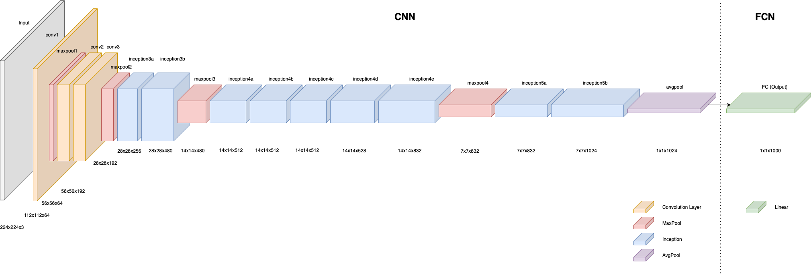

Woking in progress.....

## Introduction

This report outlines the implementation of pre-trained Convolutional Neural Networks (CNNs) to address multi-class image classification challenges. It covers model architecture, preprocessing techniques, activation functions, hyperparameter selection, training process, and evaluation metrics, demonstrating CNN effectiveness in image recognition.

### Background

CNNs are foundational in image recognition tasks. This project focuses on three pre-trained models:
- **GoogleNet**
- **MobileNet V3**
- **ResNet 50**

The training pipeline includes data augmentation, normalization, model selection, and loss function setup. We use the **Food-101** dataset from Data Vision to explore food image classification and deepen understanding of CNNs in real-world applications.

### Key Objectives

1. Apply **transfer learning** using GoogleNet, MobileNet V3, and ResNet 50.
2. **Fine-tune** the best-performing model based on initial experiments.

Each experiment involves tuning architectures and hyperparameters, with performance validated through robust evaluation. The ultimate goal is to balance **accuracy and generalization** for strong performance on unseen data.

## Dataset

This analysis uses a dataset from Data Vision containing 101 food categories, with 101,000 images total. Each category includes:

1. 250 manually reviewed test images
2. 750 training images (uncleaned, with some noise like intense colors or mislabeled data).
All images are resized to a maximum side length of 512 pixels.

### Data Preparation

Dataset is undergone data augmentation techniques by generating new variations of images to improve overfitting and improve generalisation.

Followings are data augmentation used on the training datasets:

| Transformation    | Explanation | Configuration |
|-------------------|-------------|---------------|
|RandomResizedCrop |Randomly resizing and cropping of the image | Resize to 224, scaling between 0.08 to 1.00, ratio between 3/4 and 4/3 |
|RandomHorizontalFlip|Randomly flipping the image horizontally |Flip 50% of the time |
|RandomRotation|Randomly rotate image |Rotate image +/- 10 degrees|
|ColorJitter|Apply color modification |Brightness = 0.2, Contrast = 0.2, Saturation = 0.2, Hue = 0.1|

In contrast to the training dataset, the validation and testing datasets should provide a more stable and consistent view of each image. As such, we only implement two type of transformations:

| Transformation    | Explanation | Configuration |
|-------------------|-------------|---------------|
|Resize|Resize to fixed size and keeping aspect ratio |Resize to 256 |
|CenterCrop|Crop the centre of images| Crop to 224x224|

### Data Normalisation

Since pre-trained models were trained with ImageNet normalisation, we will follow to the same procedure. The ImageNet normalisation uses a mean of [0.485, 0.456, 0.406] and a standard deviation of [0.229, 0.224, 0.225] for the respective channels (R, G, B)

